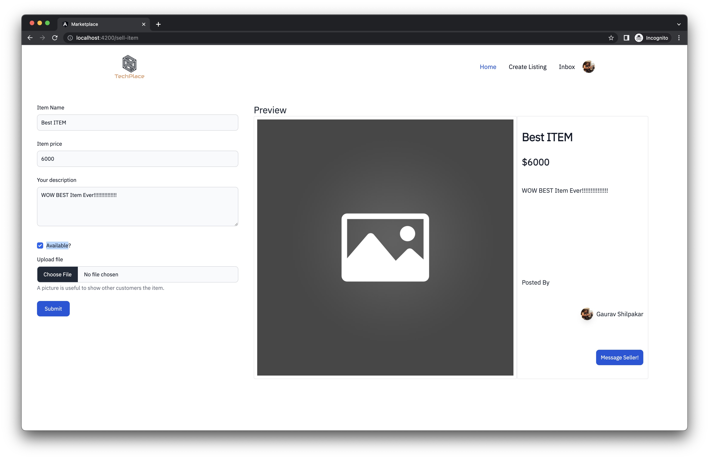

<!-- PROJECT LOGO -->
<br />
<div align="center">
  <a href="#">
    
  </a>

  ## TechPlace
  <p align="center">
    A Facebook Marketplace clone for tech items
    <br />
    <br />
    <a href="https://github.com/gauravshilpakar/TechPlace">View Demo</a>
    ·
    <a href="https://github.com/gauravshilpakar/TechPlace/issues">Report Bug</a>
    ·
    <a href="https://github.com/gauravshilpakar/TechPlace/issues">Request Feature</a>
  </p>
</div>

<!-- TABLE OF CONTENTS -->
<details>
  <summary>Table of Contents</summary>
  <ol>
    <li>
      <a href="#about-the-project">About The Project</a>
      <ul>
        <li><a href="#built-with">Built With</a></li>
      </ul>
    </li>
    <li>
      <a href="#getting-started">Getting Started</a>
      <ul>
        <li><a href="#prerequisites">Prerequisites</a></li>
        <li><a href="#installation">Installation</a></li>
      </ul>
    </li>
    <li><a href="#usage">Usage</a></li>
    <li><a href="#todo">TODO</a></li>
    <li><a href="#license">License</a></li>
    <li><a href="#contact">Contact</a></li>
  </ol>
</details>

<!-- ABOUT THE PROJECT -->
## About The Project
<a href="#readme-top">
</img>
</a>

### Built With

Tools used to build this project:

[![Springboot][Springboot-logo]][Springboot-url]
[![Angular][Angular-logo]][Angular-url]
[![Postgres][Postgres-logo]][Postgres-url]
[![DaisyUI][Daisy-ui-logo]][Daisy-ui-url]

<p align="right">(<a href="#techplace">BACK TO TOP</a>)</p>

<!-- GETTING STARTED -->
## Getting Started

To get a local copy up and running follow these simple steps.

### Prerequisites

* node 
* npm
* angular
* java
* postgreSQL 

### Installation

1. Create a Github OAUTH App. <br>https://docs.github.com/en/apps/oauth-apps/building-oauth-apps/creating-an-oauth-app
 <font size=1>
	```
	set Homepage URL and Authorization Callback URL as
	http://localhost:4200
	```
	</font>

2. Clone the repo
	<font size=1>
   ```sh
   git clone https://github.com/gauravshilpakar/TechPlace.git
   ```
	</font>

3. Install NPM packages
    <font size=1>
   ```sh
   cd frontend 
   npm install
   ng serve
   ```
   </font>

4. Create a `.env` file in the backend directory and enter your Github Secrets as
   <font size=1>
  	 ```
   	GITHUB_CLIENT_ID=***
    GITHUB_CLIENT_SECRET=***
   	```
   </font>

  <p align="center">
    
  </p>

5. Start both frontend and backend applications.
<font size=1>
	```
	frontend: localhost:4200
	backend: localhost:8080
	```
	</font>

<!-- USAGE EXAMPLES -->
## Usage
  <p align="center">
    Dashboard</img>
    Create Listing</img>
  </p>


<!-- TODO -->
## TODO
<font size=1>

	[x] Image uploads to DB
	[ ] Chat functionality
  [ ] Image Carousel for items
</font>

<!-- LICENSE -->
## License

Distributed under the MIT License. See `LICENSE` for more information.


<!-- CONTACT -->
## Contact

Gaurav Shilpakar - gaurav.shilpakar@gmail.com

Project Link: [https://github.com/gauravshilpakar/TechPlace.git](https://github.com/gauravshilpakar/TechPlace.git)

<p align="right">(<a href="#techplace">BACK TO TOP</a>)</p>


<!-- MARKDOWN LINKS & IMAGES -->
<!-- https://www.markdownguide.org/basic-syntax/#reference-style-links -->
[contributors-shield]: https://img.shields.io/github/contributors/othneildrew/Best-README-Template.svg?style=for-the-badge
[contributors-url]: https://github.com/othneildrew/Best-README-Template/graphs/contributors
[forks-shield]: https://img.shields.io/github/forks/othneildrew/Best-README-Template.svg?style=for-the-badge
[forks-url]: https://github.com/othneildrew/Best-README-Template/network/members
[stars-shield]: https://img.shields.io/github/stars/othneildrew/Best-README-Template.svg?style=for-the-badge
[stars-url]: https://github.com/othneildrew/Best-README-Template/stargazers
[issues-shield]: https://img.shields.io/github/issues/othneildrew/Best-README-Template.svg?style=for-the-badge
[issues-url]: https://github.com/othneildrew/Best-README-Template/issues
[license-shield]: https://img.shields.io/github/license/othneildrew/Best-README-Template.svg?style=for-the-badge
[license-url]: https://github.com/othneildrew/Best-README-Template/blob/master/LICENSE.txt
[linkedin-shield]: https://img.shields.io/badge/-LinkedIn-black.svg?style=for-the-badge&logo=linkedin&colorB=555
[linkedin-url]: https://linkedin.com/in/othneildrew
[product-screenshot]: ./frontend/src/assets/laptop.jpg

[Angular-logo]: https://img.shields.io/badge/Angular-DD0031?style=for-the-badge&logo=angular&logoColor=white
[Angular-url]: https://angular.io/

[Bootstrap.com]: https://img.shields.io/badge/Bootstrap-563D7C?style=for-the-badge&logo=bootstrap&logoColor=white
[Bootstrap-url]: https://getbootstrap.com

[Postgres-url]: https://www.postgresql.org/
[Postgres-logo]: https://img.shields.io/badge/PostgreSQL-2497d2?style=for-the-badge&logo=PostgreSQL&logoColor=white

[Tailwind-url]: https://www.postgresql.org/
[Tailwind-logo]: https://img.shields.io/badge/PostgreSQL-2497d2?style=for-the-badge&logo=PostgreSQL&logoColor=white

[Daisy-ui-url]: https://daisyui.com/
[Daisy-ui-logo]: https://img.shields.io/badge/daisyUI-yellow?style=for-the-badge&logo=daisyui&logoColor=white


[Springboot-logo]: https://img.shields.io/badge/Springboot-green?style=for-the-badge&logo=Springboot&logoColor=white
[Springboot-url]: https://spring.io/projects/spring-boot